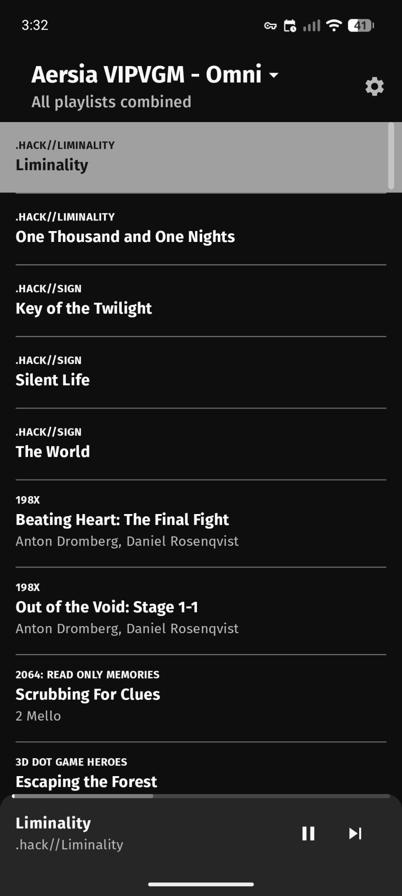
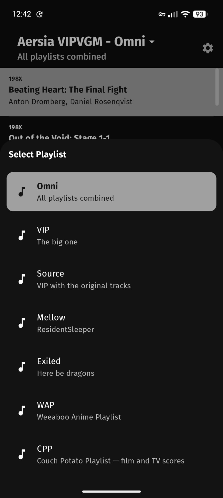
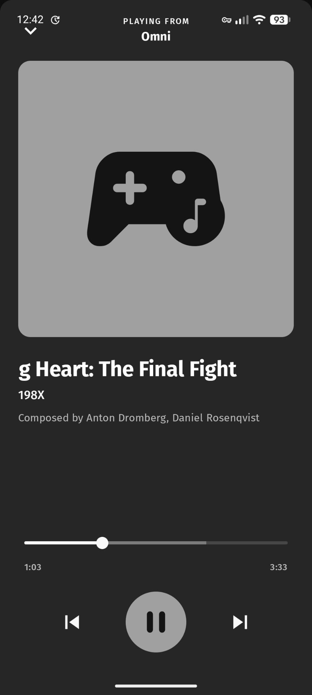

# Aersia VIPVGM Player — Android

A native Android companion app to [Aersia VIPVGM Player — Self-Hosted Fork](https://github.com/AC-DAC/aersia-vip-player-self-hosted-fork), providing background audio playback and full playlist parity with the self-hosted web player.

The web player originally shipped a PWA for mobile use, but background audio playback proved unreliable on Android and iOS due to OS power management restrictions. A native Android app was the correct solution — this fork of [VidyaMusic by MateusRodCosta](https://github.com/MateusRodCosta/VidyaMusic) was chosen for its native Media3 playback backend, Jetpack Compose UI, and clean architecture.

Licensed under AGPLv3-or-later. Source code is publicly available in accordance with the licence terms.

---

## Playlists

Full parity with the self-hosted web player:

| Playlist | Description |
|----------|-------------|
| Omni | All playlists combined, sorted alphabetically |
| VIP | The big one — curated VGM remixes |
| Source | VIP with original game tracks |
| Mellow | Downtempo selections |
| Exiled | Tracks that didn't make the cut |
| WAP | Weeaboo Anime Playlist |
| CPP | Couch Potato Playlist — film and TV scores |

Omni is the default playlist on first launch.

---

## What's Different from Upstream

The following features were added on top of the original VidyaMusic codebase:

**Playlist additions:**
- Source playlist filter — only shows tracks with source audio files, matching web player behaviour
- WAP and CPP playlists — XML (XSPF) roster support added; upstream is JSON-only
- Omni playlist — concurrent fetch of all six playlists, merged and sorted alphabetically; selected by default on first launch

**Persistence:**
- Per-playlist position memory — each playlist independently remembers last track and playback position
- Position and track index are saved atomically (read together directly from the media controller) to prevent mismatches when a track transitions at the moment the app backgrounds
- Shuffle state persists across sessions and playlist switches
- All state restored on app restart

**Settings:**
- Shuffle on/off toggle in Settings → Playback (removed from the player screen)
- Skip playlist intro toggle
- Bluetooth auto-launch — posts a notification when a Bluetooth device connects; tap the notification to open the app with the player expanded and resume playback. Requires BLUETOOTH_CONNECT permission (Android 12+); toggling on will prompt for permission — denied permission reverts the toggle to off and shows a snackbar explanation

**Branding:**
- App renamed to "Aersia VIPVGM Player — Android" throughout
- Attribution and description updated to reflect the fork origin
- Repository URL updated to this fork

**CI:**
- GitHub Actions release workflow: debug APK built automatically on `v*` tag push and attached to the corresponding GitHub Release

---

## Tech Stack

| Layer | Technology |
|-------|-----------|
| Language | Kotlin |
| UI | Jetpack Compose (Material 3) |
| Playback | Media3 (ExoPlayer + MediaSessionService) |
| Architecture | Clean Architecture (app / core / data / domain / features) |
| DI | Koin |
| Persistence | Jetpack DataStore |
| Playlist formats | JSON (VIP, Source, Mellow, Exiled) + XML/XSPF (WAP, CPP) |
| Build | Gradle |

---

## Features

- Background audio playback via Media3 foreground service
- Lock screen and notification media controls
- Steering wheel / headphone media button support (next, previous, play/pause)
- Per-playlist position memory with shuffle-aware resume
- Bluetooth auto-launch notification (optional, toggle in Settings → Playback — requires BLUETOOTH_CONNECT permission on Android 12+); notification tap opens app with player expanded
- Material 3 UI with dynamic colour and dark/light theme support

---

## Installation

This app is for internal personal use and is not published on the Google Play Store.

**GitHub Releases (recommended):**

Tagged releases (`v*`) automatically build a debug APK via GitHub Actions and attach it to the corresponding GitHub Release. Download the APK from the Releases page and install directly.

**Sideload via ADB (debug build):**
```bash
./gradlew assembleDebug
adb install app/build/outputs/apk/debug/app-debug.apk
```

Enable "Install from unknown sources" on your device if installing manually via file transfer.

---

## Screenshots

<table>
  <tr>
    <td></td>
    <td></td>
    <td></td>
    <td></td>
  </tr>
</table>

---

## AI Usage Disclaimer

Development of this fork made extensive use of [Claude](https://claude.ai) (Anthropic) as a coding assistant, used for:

- Architectural guidance on Media3 and Jetpack Compose integration
- Debugging playback state synchronisation issues
- Implementing XML/XSPF parsing alongside the existing JSON pipeline
- Persistence and DataStore patterns
- Bluetooth broadcast receiver implementation

---

## Attribution

Original application by [MateusRodCosta](https://github.com/MateusRodCosta/VidyaMusic).  
All playlist content © & ℗ their respective owners.  
Playlist curated by Cats777 — original playlist available at [vipvgm.net](https://www.vipvgm.net/).
